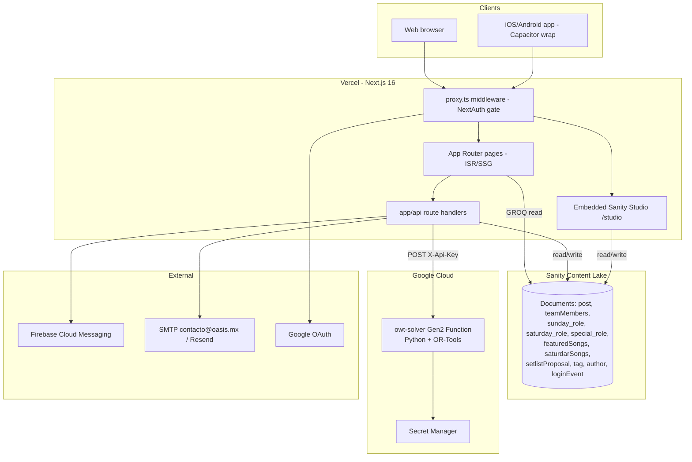
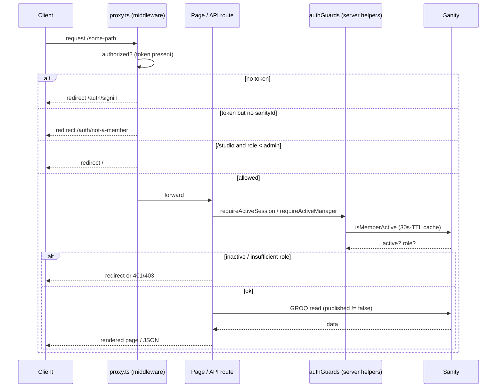
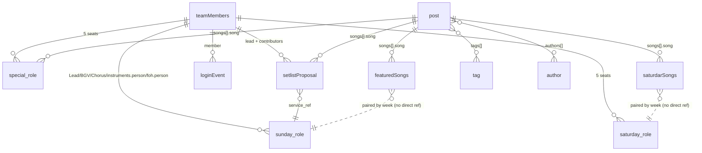
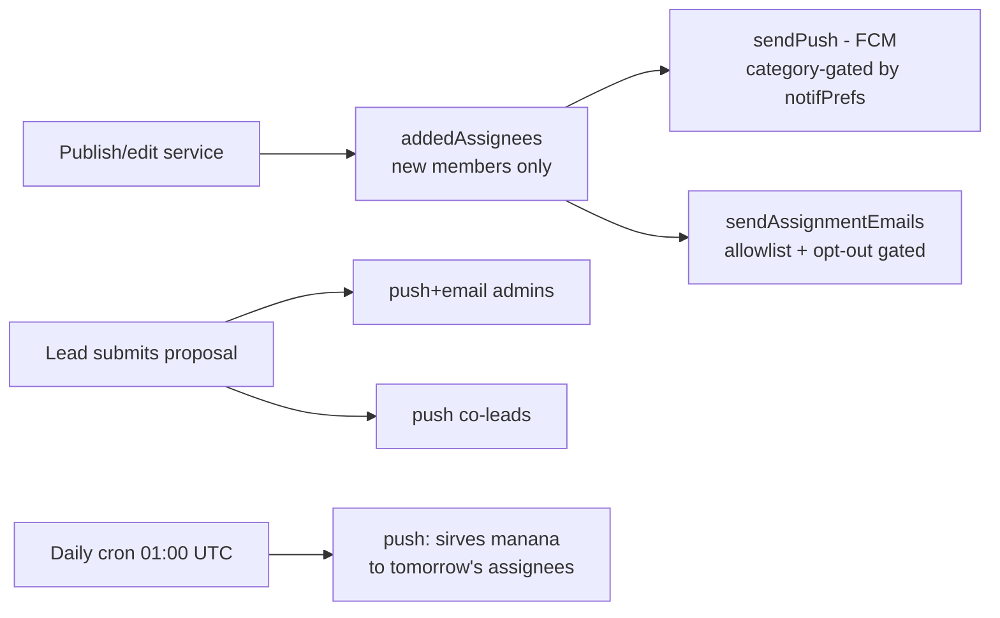

# Architecture — OWT Backstage (`owt-kb-v1`)

This is the master orientation document. It explains **what the system is, how the pieces
fit, how a request flows, and the invariants that make the app correct.** Every other doc in
this folder drills into one slice; start here.

---

## 1. What this app is

**OWT Backstage** is an internal web + mobile app for the **Oasis Worship Team**, a church
music ministry. It replaces spreadsheets and WhatsApp threads with a single source of truth for:

- **Song library** — lyrics (Portable Text), chord charts (per key), audio tracks, YouTube
  practice references, tutorials, tags, and authors (~140 songs).
- **Services & setlists** — Sunday, Saturday, and one-off "special" services, each with a
  song list and role assignments.
- **Role assignments** — who leads, sings background vocals (BGV), sings chorus, plays each
  instrument, and runs Front-of-House (FOH) for each service.
- **Member availability** — members mark dates they can't serve.
- **Shared setlist proposals** — co-leads collaboratively draft a setlist; an admin approves it.
- **Auto-scheduling** — an OR-Tools constraint solver generates a fair monthly roster.
- **Notifications** — push (FCM) and email (SMTP/Resend) on assignment/publish/reminders.

The UI is **entirely in Spanish** (`<html lang="es">`), **dark-mode-first**, and the entire
app is behind a login gate (there is no anonymous public surface except the auth pages).

---

## 2. Tech stack

| Layer | Choice | Notes |
|-------|--------|-------|
| Framework | **Next.js 16** (App Router) | `proxy.ts` is the middleware (Next 16 renamed `middleware.ts` → `proxy.ts`). |
| UI | **React 19**, **Tailwind CSS 3**, `@tailwindcss/typography` | `darkMode: "class"`; three Google fonts (Advent Pro / Urbanist / Jura) via CSS vars in the client UI (+ Orbitron in the Studio layout). |
| CMS / DB | **Sanity v5** via `next-sanity` | Project `ebb8vcnk`, dataset `production`. Studio embedded at `/studio`. |
| Auth | **NextAuth v4** | JWT sessions (7-day), Google SSO (web + native), email/password (bcrypt). |
| Search | **Fuse.js** + `normalizeText` | Accent-insensitive fuzzy search over songs/members. |
| Solver | **Python 3.12 + OR-Tools CP-SAT** | Deployed as a Gen-2 Google Cloud Function (`owt-solver`). |
| Email | **nodemailer (SMTP)** primary, **Resend** fallback | Live via `contacto@oasis.mx`. |
| Push | **Firebase Admin (FCM)** | Self-healing dead-token pruning. |
| Mobile | **Capacitor 8** | Wraps the web app; iOS + Android projects committed. |
| Hosting | **Vercel** (web) + **Google Cloud** (solver) | `vercel.json` defines one daily cron. |
| Runtime | **Node 22** (`.nvmrc`, `engines.node`) | Required by Capacitor 8. |
| Tests | **Vitest** (JS/TS), **unittest** (Python solver) | `npm test` runs vitest. |

---

## 3. High-level topology



---

## 4. Request lifecycle

Every request (except the small public allow-list) passes through **`proxy.ts`**
(NextAuth `withAuth` middleware) before hitting a page or API route:



**Two-layer defense:** the middleware is the coarse gate (must be logged in; Studio needs
admin+). Individual pages/routes re-check with `requireActiveSession` / `requireActiveManager`
so a disabled member is blocked within the 30s access-cache window even if their JWT is still
valid. See [AUTH_AND_SECURITY.md](AUTH_AND_SECURITY.md).

---

## 5. Rendering & caching model

The public-facing member pages are **statically rendered with ISR** and must be explicitly
revalidated after writes. This is the single most common source of "my edit didn't show up"
bugs — respect it.

| Page | Strategy | Detail |
|------|----------|--------|
| `/` (home / "Esta semana") | ISR `revalidate = 60` | This weekend's services + full song list. |
| `/schedule` | ISR `revalidate = 60` | Upcoming services; `?m=` month browse. |
| `/author`, `/author/[slug]`, `/tag`, `/tag/[slug]` | ISR `revalidate = 60` | Indexes + filtered song lists. |
| `/me` | ISR `revalidate = 60` | Member's assignments/profile (session-scoped data fetched fresh via `serverClient`). |
| `/posts/[slug]` | **SSG** `revalidate = 3600` + `generateStaticParams()` | All song pages prebuilt. |
| `/me/propose/[roleId]` | `revalidate = 0` | Always dynamic (proposal editing). |
| `/admin` | dynamic | Session-gated; data fetched client-side from `/api/admin/*`. |
| `/studio` | `dynamic = 'force-static'` | Sanity Studio SPA. |

**The cache contract:** any admin/API route that mutates content **must** call the matching
revalidate helper in [`app/utils/revalidate.ts`](../app/utils/revalidate.ts) (or
`revalidatePath`) or the ISR page stays stale:

- `revalidateServiceViews()` → `/`, `/schedule`, `/posts/[slug]` (setlist/team/service changes).
- `revalidateSongViews()` → `/`, `/posts/[slug]`, `/tag`, `/tag/[slug]` (song content changes).

**Three Sanity clients** back this (`client` in [`sanity/lib/client.ts`](../sanity/lib/client.ts);
`serverClient` + `writeClient` both in [`sanity/lib/serverClient.ts`](../sanity/lib/serverClient.ts)):
- `client` — anonymous, `useCdn: false` (regenerated ISR pages must read live, not stale CDN).
- `serverClient` — read token, used in server components & auth callbacks.
- `writeClient` — write token, used only in admin API routes.

---

## 6. The domain model in one picture



Key subtleties (full detail in [DATA_MODEL.md](DATA_MODEL.md)):
- **Sunday/Saturday split their data** across a *role* doc (assignments + `published` flag)
  and a *setlist* doc (songs). They are **paired by matching `week`**, not by a reference.
- **`special_role` combines** assignments + setlist in one doc, keyed on `date` (not `week`).
- The `published` flag lives on the **role doc only**; setlist visibility is gated indirectly
  through `publishedSetlist(role, setlist)`.

---

## 7. The five member-referencing seats

Every role doc (`sunday_role`, `saturday_role`, `special_role`) references members through
**exactly five seat paths**. Miss one and notifications/participation/emails silently skip
people:

```
Lead[]._ref                 // array of references — Leaders
BGVs[]._ref                 // array of references — Background Vocals
Chorus[]._ref               // array of references — Coro
instruments[].person._ref   // object array — person nested under .person
foh_team[].person._ref      // object array — person nested under .person
```

**Single source of truth:** `assignedMemberRefsQuery(roleFilter)` in
[`app/utils/notifyTargets.ts`](../app/utils/notifyTargets.ts) builds the GROQ that covers all
five. Reuse it for any "who serves this service?" query — never hand-roll seat traversal.

---

## 8. Notifications pipeline

Publishing or editing a service, and submitting/approving a proposal, fan out notifications.
**All notification paths are best-effort** (wrapped in try/catch, log-only) — a failed notify
must never fail the underlying write.



- **Push categories:** `assignments`, `setlist`, `proposals`, `reminders`. Each gated by the
  member's `notifPrefs`. Dead FCM tokens are auto-pruned.
- **Email:** SMTP preferred (`contacto@oasis.mx`), Resend fallback; gated by `EMAIL_ALLOWLIST`
  (default `"*"` = whole team) and the per-member `notifPrefs.email` opt-out.
- **Opt-out is permissive by default:** an unset pref means opted-in.

See [API_REFERENCE.md](API_REFERENCE.md) for which endpoints fire what, and
[UTILITIES_AND_COMPONENTS.md](UTILITIES_AND_COMPONENTS.md) for `push.ts`, `assignmentEmail.ts`,
`proposalNotify.ts`.

---

## 9. Repository map

```
owt-kb-v1/
├─ app/                      # Next.js App Router
│  ├─ (client)/              # member-facing route group (own <html> root layout)
│  │  ├─ page.tsx            # / home "Esta semana"
│  │  ├─ admin/              # /admin dashboard (manager-gated)
│  │  ├─ auth/               # signin, not-a-member
│  │  ├─ author/, tag/       # indexes + [slug] filtered song lists
│  │  ├─ posts/[slug]/       # song detail (SSG)
│  │  ├─ me/                 # member profile + propose/[roleId] proposal editor
│  │  ├─ schedule/           # upcoming services calendar
│  │  ├─ layout.tsx, globals.css, loading.tsx, error.tsx
│  ├─ (admin)/               # separate route group for embedded Sanity Studio
│  │  └─ studio/[[...tool]]/ # /studio
│  ├─ api/                   # 31 route handlers (see API_REFERENCE.md)
│  ├─ components/            # 41 components (31 top-level + 10 admin panels)
│  ├─ context/               # PlayerContext (the single global context)
│  └─ utils/                 # reusable helpers (27 .ts + .mjs/.tsx) + __tests__
├─ sanity/                   # schema + client setup
│  ├─ schema.ts, env.ts
│  ├─ lib/{client,serverClient,image}.ts
│  └─ schemas/*.ts           # 11 registered types + deprecated/unregistered
├─ gcf/                      # Python OR-Tools solver (owt-solver Cloud Function)
├─ scripts/                  # one-off migrations, imports, ops (guarded by --apply)
├─ ios/, android/, mobile/   # Capacitor native projects + offline fallback
├─ public/                   # PWA manifest, icons, brand images
├─ docs/                     # ← you are here
├─ auth.ts                   # NextAuth config (providers, callbacks, impersonation)
├─ proxy.ts                  # Next.js middleware (auth gate)
├─ next.config.mjs           # security headers, image domains
├─ capacitor.config.ts, cloudbuild.yaml, vercel.json
├─ CLAUDE.md, AGENTS.md      # terse invariants briefing
└─ package.json, tsconfig.json, tailwind.config.ts, vitest.config.ts
```

---

## 10. Timezone & dates

**Timezone is `America/Mexico_City`. This is a correctness invariant, not a preference.**

Service dates are Sanity `date` type (`YYYY-MM-DD` strings). The rules:

- **Render a stored date pinned to local noon:**
  `new Date(iso.slice(0,10) + "T12:00:00")` — **never** bare `new Date(iso)`, which parses as
  UTC midnight and flips the day for anyone west of UTC.
- **Server "today":**
  `new Date().toLocaleDateString("sv", { timeZone: "America/Mexico_City" })` (Swedish locale → ISO format).
- **For "Hoy/Ayer/Mañana" labels and countdowns:** use a **calendar-day diff at local noon**,
  not elapsed hours (elapsed math is off-by-one near midnight). See `daysUntil` in
  `NextServiceHero.tsx` and `computeParticipation.plusOneDay`.
- **For TZ-stable pure arithmetic** (month bounds, ICS), read via `Date.UTC(...)` only — see
  `scheduleMonths.ts` and `ics.ts`.

There is no single "dateUtils" module — the convention is applied inline everywhere. Match it.

---

## 11. The load-bearing invariants (do not break)

These are the things that look like bugs but aren't, or that silently corrupt data if ignored.
Condensed here; each is expanded in the linked doc.

1. **`saturdarSongs` is a deliberate misspelling of "Saturday Songs."** GROQ across the app
   filters `_type == "saturdarSongs"`. Renaming it orphans all Saturday setlist data. Sunday's
   setlist type is `featuredSongs`. → [DATA_MODEL](DATA_MODEL.md)
2. **Timezone = America/Mexico_City; local-noon rendering.** → §10.
3. **Five member-referencing seats.** Use `assignedMemberRefsQuery()`. → §7.
4. **Member-facing reads filter `published != false`** (missing = grandfathered published;
   explicit `false` = draft). Setlists gate through `publishedSetlist()`. → [DATA_MODEL](DATA_MODEL.md#draftpublish-gating)
5. **Sanity array-of-object writes need a unique `_key` per item** (and the right `_type` for
   object slots: `setlist_song`, `proposal_song`, `instrument_slot`, `foh_slot`, `contributor`;
   reference-array items use `_type: "reference"`). Note `proposal_song` — proposal songs are
   **not** `setlist_song`.
6. **Mutating routes must revalidate** their ISR pages. → §5.
7. **Client mutation handlers** must wrap `fetch` in try/catch/finally, check `res.ok`, reset
   the loading flag, and never close-as-success on failure. (This is audited — keep it so.)
8. **Impersonation is super-admin-only, enforced server-side in `auth.ts`'s `jwt` callback.**
   Never move that check client-side. → [AUTH_AND_SECURITY](AUTH_AND_SECURITY.md#impersonation)
9. **`proxy.ts` matcher must stay byte-for-byte equal to `MIDDLEWARE_MATCHER`** in
   `app/utils/routeMatcher.ts` (a test enforces this). Each excluded prefix is anchored with
   `(?:/|$)` so `/author` isn't mistaken for the public `/auth` route.
10. **GROQ string interpolation is allowed in exactly two audited places** (the trusted
    `roleFilter` in `assignedMemberRefsQuery`, and opaque FCM tokens in `push.ts`). Everywhere
    else, use bound `$params`.
11. **Production Sanity writes require explicit user consent.** Diagnosing ≠ consent. Data
    scripts dry-run by default and only write with `--apply`. → [DEVELOPMENT](DEVELOPMENT.md#data-scripts)

---

## 12. Known landmines & deferred work

Don't rediscover these as "bugs":

- **`SongFormModal` / `EditSongButton` collapse a multi-chord-chart song to a single chart on
  save.** 0 songs affected today; fixing it properly is a real feature, not a quick patch.
- **~15 songs have no lyrics** because they're absent from the source catalog PDF (expected).
- **Android build pending; Apple Developer enrollment in progress** (mobile Phase 1 verified on
  iOS device). → [MOBILE.md](MOBILE.md)
- **Two schema files are intentionally unregistered:** `youtubeType.ts` (an object type) and
  `[deprecated]roleSat.ts` (an old Saturday-role shape). Don't wire them in.
- **No service worker / offline support yet** — planned for mobile Phase 2.

---

## 13. Continuous improvement loop

The repo ships a `/improve` command ([`.claude/commands/improve.md`](../.claude/commands/improve.md))
designed to run on `/loop /improve`: it performs **one verified improvement per run** with a
priority ladder (correctness → security → broken behavior → a11y → UX → perf → tests →
small features → tech debt), a hard verify gate (`tsc` + tests must be green), and an
**honesty gate** — an empty run (nothing worth changing) is a success, never manufacture churn.
The same distilled cheat-sheet lives at the bottom of that file.
