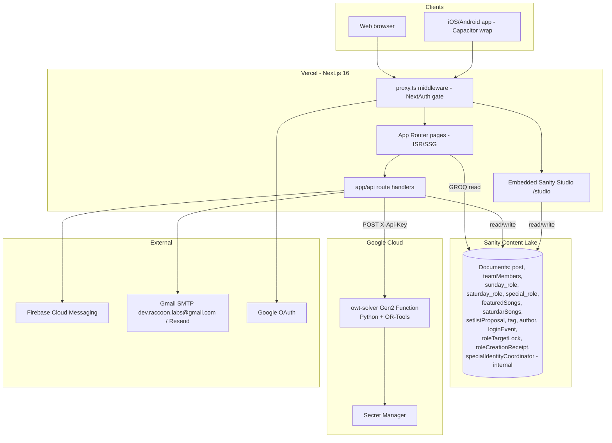
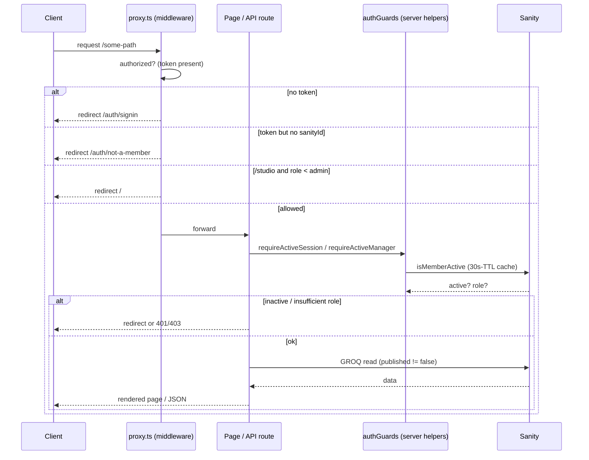
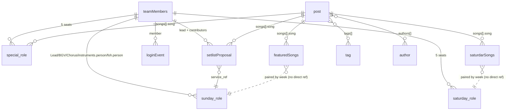
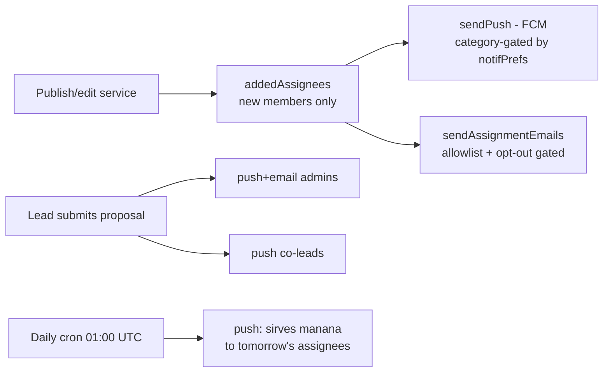

# Architecture — OWT Backstage (`owt-kb-v1`)

This is the master orientation document. It explains **what the system is, how the pieces
fit, how a request flows, and the invariants that make the app correct.** Every other doc in
this folder drills into one slice; start here.

---

## 1. What this app is

**OWT Backstage** is an internal web + mobile app for the **Oasis Worship Team**, a church
music ministry. It replaces spreadsheets and WhatsApp threads with a single source of truth for:

- **Song library** — lyrics (Portable Text), chord charts (per key), audio tracks, YouTube
  practice references, tutorials, tags, and authors (~140 songs).
- **Services & setlists** — Sunday, Saturday, and one-off "special" services, each with a
  song list and role assignments.
- **Role assignments** — who leads, sings background vocals (BGV), sings chorus, plays each
  instrument, and runs Front-of-House (FOH) for each service.
- **Member availability** — members mark dates they can't serve.
- **Shared setlist proposals** — co-leads collaboratively draft a setlist; an admin approves it.
- **Auto-scheduling** — an OR-Tools constraint solver generates a fair monthly roster.
- **Notifications** — push (FCM) and email (SMTP/Resend) on assignment/publish/reminders.

The UI is **entirely in Spanish** (`<html lang="es">`), **themed dark or light — following the
device unless the member pins one at `/me`** (ADR-0016), and the entire
app is behind a login gate (the only anonymous surfaces are the auth pages, the cron
routes, the service-readiness identity route and the theme gallery — see ADR-0017).

---

## 2. Tech stack

| Layer | Choice | Notes |
|-------|--------|-------|
| Framework | **Next.js 16** (App Router) | `proxy.ts` is the middleware (Next 16 renamed `middleware.ts` → `proxy.ts`). |
| UI | **React 19**, **Tailwind CSS 3**, `@tailwindcss/typography` | `darkMode: "class"`; three Google fonts (Advent Pro / Urbanist / Jura) via CSS vars in the client UI (+ Orbitron in the Studio layout). |
| CMS / DB | **Sanity v5** via `next-sanity` | Project `ebb8vcnk`, dataset `production`. Studio embedded at `/studio`. |
| Auth | **NextAuth v4** | JWT sessions (7-day), Google SSO (web + native), email/password (bcrypt). |
| Search | **Fuse.js** + `normalizeText` | Accent-insensitive fuzzy search over songs/members. |
| Solver | **Python 3.12 + OR-Tools CP-SAT** | Deployed as a Gen-2 Google Cloud Function (`owt-solver`). |
| Email | **nodemailer (SMTP)** primary, **Resend** fallback | Live via Gmail SMTP as `dev.raccoon.labs@gmail.com`. |
| Push | **Firebase Admin (FCM)** | Self-healing dead-token pruning. |
| Mobile | **Capacitor 8** | Wraps the web app; iOS + Android projects committed. |
| Hosting | **Vercel** (web) + **Google Cloud** (solver) | `vercel.json` defines one daily cron. |
| Runtime | **Node 22** (`.nvmrc`, `engines.node`) | Capacitor 8 needs ≥22; pinned to exact `22.x` per [ADR-0002](adr/0002-node-pinned-to-exact-22x.md). |
| Tests | **Vitest** (JS/TS), **unittest** (Python solver) | `npm test` runs vitest. |

---

## 3. High-level topology


```mermaid
flowchart TB
  subgraph Clients
    Web[Web browser]
    iOS[iOS/Android app - Capacitor wrap]
  end

  subgraph Vercel[Vercel - Next.js 16]
    MW[proxy.ts middleware - NextAuth gate]
    Pages[App Router pages - ISR/SSG]
    API[app/api route handlers]
    Studio[Embedded Sanity Studio /studio]
  end

  subgraph Sanity[Sanity Content Lake]
    Docs[(Documents: post, teamMembers,\nsunday_role, saturday_role, special_role,\nfeaturedSongs, saturdarSongs,\nsetlistProposal, tag, author, loginEvent,\nroleTargetLock, roleCreationReceipt,\nspecialIdentityCoordinator - internal)]
  end

  subgraph Google[Google Cloud]
    GCF[owt-solver Gen2 Function\nPython + OR-Tools]
    SM[Secret Manager]
  end

  subgraph External
    FCM[Firebase Cloud Messaging]
    SMTP[Gmail SMTP dev.raccoon.labs@gmail.com / Resend]
    GAuth[Google OAuth]
  end

  Web --> MW
  iOS --> MW
  MW --> Pages
  MW --> Studio
  Pages --> API
  Pages -->|GROQ read| Docs
  API -->|read/write| Docs
  Studio -->|read/write| Docs
  API -->|POST X-Api-Key| GCF
  GCF --> SM
  API --> FCM
  API --> SMTP
  MW --> GAuth
```

---

## 4. Request lifecycle

Every request (except the small public allow-list — auth, cron, the A3 identity route
and the theme gallery) passes through **`proxy.ts`**
(NextAuth `withAuth` middleware) before hitting a page or API route:


```mermaid
sequenceDiagram
  participant U as Client
  participant MW as proxy.ts (middleware)
  participant P as Page / API route
  participant G as authGuards (server helpers)
  participant S as Sanity

  U->>MW: request /some-path
  MW->>MW: authorized? (token present)
  alt no token
    MW-->>U: redirect /auth/signin
  else token but no sanityId
    MW-->>U: redirect /auth/not-a-member
  else /studio and role < admin
    MW-->>U: redirect /
  else allowed
    MW->>P: forward
    P->>G: requireActiveSession / requireActiveManager
    G->>S: isMemberActive (30s-TTL cache)
    S-->>G: active? role?
    alt inactive / insufficient role
      P-->>U: redirect or 401/403
    else ok
      P->>S: GROQ read (published != false)
      S-->>P: data
      P-->>U: rendered page / JSON
    end
  end
```

**Two-layer defense:** the middleware is the coarse gate (must be logged in; Studio needs
admin+). Individual pages/routes re-check with `requireActiveSession` / `requireActiveManager`
so a disabled member is blocked within the 30s access-cache window even if their JWT is still
valid. See [AUTH_AND_SECURITY.md](AUTH_AND_SECURITY.md).

---

## 5. Rendering & caching model

The public-facing member pages are **statically rendered with ISR** and must be explicitly
revalidated after writes. This is the single most common source of "my edit didn't show up"
bugs — respect it.

| Page | Strategy | Detail |
|------|----------|--------|
| `/` (home / "Esta semana") | ISR `revalidate = 60` | This weekend's services + full song list. |
| `/schedule` | ISR `revalidate = 60` | Upcoming services; `?m=` month browse. |
| `/author`, `/author/[slug]`, `/tag`, `/tag/[slug]` | ISR `revalidate = 60` | Indexes + filtered song lists. |
| `/me` | ISR `revalidate = 60` | Member's assignments/profile (session-scoped data fetched fresh via `serverClient`). |
| `/posts/[slug]` | **SSG** `revalidate = 3600` + `generateStaticParams()` | All song pages prebuilt. |
| `/me/propose/[roleId]` | `revalidate = 0` | Always dynamic (proposal editing). |
| `/admin` | dynamic | Session-gated; data fetched client-side from `/api/admin/*`. |
| `/studio` | `dynamic = 'force-static'` | Sanity Studio SPA. |

**The cache contract:** any admin/API route that mutates content **must** call the matching
revalidate helper in [`app/utils/revalidate.ts`](../app/utils/revalidate.ts) (or
`revalidatePath`) or the ISR page stays stale:

- `revalidateServiceViews()` → `/`, `/schedule`, `/posts/[slug]` (setlist/team/service changes).
- `revalidateSongViews()` → `/`, `/posts/[slug]`, `/tag`, `/tag/[slug]` (song content changes).

**Five Sanity clients** back this (`client` in [`sanity/lib/client.ts`](../sanity/lib/client.ts);
`serverClient` + `writeClient` in [`sanity/lib/serverClient.ts`](../sanity/lib/serverClient.ts);
`operationalClient` + `rawIntegrityClient` in
[`sanity/lib/operationalClient.ts`](../sanity/lib/operationalClient.ts)):
- `client` — anonymous, `useCdn: false` (regenerated ISR pages must read live, not stale CDN).
- `serverClient` — read token, used in server components & auth callbacks.
- `writeClient` — write token, used only in admin API routes.
- `operationalClient` — `perspective: "published"`, `useCdn: false`, `server-only`. **The only
  runtime read source for the six protected service types.** → §8.
- `rawIntegrityClient` — `perspective: "raw"`, tokened, `server-only`. Inventories `drafts.*`
  as integrity *evidence* only; never a runtime content source. → §8.

The first three set **no** `perspective`, which is exactly why §8 exists.

---

## 6. The domain model in one picture


```mermaid
erDiagram
  teamMembers ||--o{ sunday_role : "Lead/BGV/Chorus/instruments.person/foh.person"
  teamMembers ||--o{ saturday_role : "5 seats"
  teamMembers ||--o{ special_role : "5 seats"
  teamMembers ||--o{ setlistProposal : "lead + contributors"
  teamMembers ||--o{ loginEvent : "member"
  post ||--o{ featuredSongs : "songs[].song"
  post ||--o{ saturdarSongs : "songs[].song"
  post ||--o{ special_role : "songs[].song"
  post ||--o{ setlistProposal : "songs[].song"
  post }o--o{ tag : "tags[]"
  post }o--o{ author : "authors[]"
  setlistProposal }o--|| sunday_role : "service_ref"
  featuredSongs }o..|| sunday_role : "paired by week (no direct ref)"
  saturdarSongs }o..|| saturday_role : "paired by week (no direct ref)"
```

Key subtleties (full detail in [DATA_MODEL.md](DATA_MODEL.md)):
- **Sunday/Saturday split their data** across a *role* doc (assignments + `published` flag)
  and a *setlist* doc (songs). They are **paired by matching `week`**, not by a reference.
- **`special_role` combines** assignments + setlist in one doc, keyed on `date` (not `week`).
- The `published` flag lives on the **role doc only**; setlist visibility is gated indirectly
  through `publishedSetlist(role, setlist)`.

---

## 7. The five member-referencing seats

Every role doc (`sunday_role`, `saturday_role`, `special_role`) references members through
**exactly five seat paths**. Miss one and notifications/participation/emails silently skip
people:

```
Lead[]._ref                 // array of references — Leaders
BGVs[]._ref                 // array of references — Background Vocals
Chorus[]._ref               // array of references — Coro
instruments[].person._ref   // object array — person nested under .person
foh_team[].person._ref      // object array — person nested under .person
```

**Single source of truth:** `assignedMemberRefsQuery(roleFilter)` in
[`app/utils/notifyTargets.ts`](../app/utils/notifyTargets.ts) builds the GROQ that covers all
five. Reuse it for any "who serves this service?" query — never hand-roll seat traversal.

---

## 8. Canonical operational reads

The **six protected stored types** — `sunday_role`, `saturday_role`, `special_role`,
`featuredSongs`, `saturdarSongs` (the deliberate typo — never renamed), `setlistProposal` —
are read through one contract. Everything below exists because of a single Sanity default.

### Published vs raw perspective

[`sanity/lib/operationalClient.ts`](../sanity/lib/operationalClient.ts) exports two clients:

- **`operationalClient`** — `perspective: "published"`, `useCdn: false`, `server-only`. The
  **only** runtime source for the protected types. The read token is optional; when present it
  widens document access, never the perspective.
- **`rawIntegrityClient`** — `perspective: "raw"`, tokened, `server-only`. Exists **solely to
  inventory `drafts.*` documents as integrity evidence** (duplicate / dangling / draft-conflicted
  state). It is never a runtime content source.

**Why this matters:** the pre-existing `sanity/lib/client.ts` sets no `perspective`, and the
default perspective for this repo's `apiVersion` (`2024-07-23`, i.e. pre-`2025-02-19`) is
**`raw`** — so unpublished Studio drafts were previously overlaid onto member-facing reads.
Setting the perspective explicitly is the whole point.

### Canonical ≠ member-visible

Two **different** gates that must never be conflated:

| Gate | Meaning |
|------|---------|
| **canonical** | a non-`drafts.*` document from the **published perspective**, regardless of the app's `published` field value |
| **member-visible** | canonical **and** passing the app-level `published != false` draft gate |

**Canonical counts, duplicate detection, and target grouping never use the app-level gate.**
Publish state is reported alongside, not folded in. (The app-level gate itself is unchanged —
see [DATA_MODEL](DATA_MODEL.md#draftpublish-gating).)

### Fail-closed reads

Three pure, I/O-free modules carry the rules, so they are exhaustively unit-testable:

- [`app/utils/serviceReadQueries.ts`](../app/utils/serviceReadQueries.ts) — bound GROQ
  (`{query, params}`) for the canonical projections and the `drafts.*`-scoped raw inventory.
- [`app/utils/serviceReadModel.ts`](../app/utils/serviceReadModel.ts) — role validity across the
  five seat paths, target keys, `setlistContentState` (`empty|incomplete|ready|invalid`, where
  malformed or dangling is **`invalid`, not `incomplete`**), proposal validation + the dual
  indexes, `resolveMembers` (dangling-ref detection), `publicTargetState` (`draft_conflict`).
- [`app/utils/serviceReadSelect.ts`](../app/utils/serviceReadSelect.ts) — selection helpers that
  refuse to guess: `pickUnique` (a duplicate target yields **nothing**, never an arbitrary `[0]`),
  `indexUniqueByKey`, `canonicalizePlayHistory`, `serviceDayKey` (a malformed stored date returns
  `null` and the row is dropped as an integrity issue instead of crashing a date `.slice()`).

### The protected-read audit rule

[`app/utils/protectedReadAudit.ts`](../app/utils/protectedReadAudit.ts) plus its test scan every
**git-tracked** query site for reads/writes of the seven audited protected operational types and
**fail** on any that bypasses the operational client without an exact `file + operation` exemption.
Detection covers:

1. quoted type literals (`_type == "sunday_role"`, `_type in [...]`);
2. generic `_id` / `references()` queries whose **projection consumes protected fields**;
3. **mutation** operations whose region names a protected type;
4. **mutation** operations that resolve a document through a **protected loader** —
   `loadRoleForWrite`, `loadRoleForMutation`, `loadCanonicalRole`, `loadCanonicalProposal`,
   `resolveOwnedCoordination`, `loadSpecialIdentityCoordinator` — even when no type is named
   anywhere in the region.

There are **no directory or glob exemptions** — every entry names one file and one operation, and
gitignored local tooling is out of scope (never listed, never asserted to exist).

### Five disjoint exemption registries

The registries are separate on purpose: *"a read we have not migrated yet"* and *"a writer that must
write"* are different claims, with different owners and different lifetimes. Collapsing them would
let a regression in the first hide behind the second. A test asserts they are pairwise disjoint and
that **no entry is dead** (each must be exercised by a real scanned site).

| Registry | Satisfies | Contents | Owner |
|----------|-----------|----------|-------|
| `A2_HANDOFF_ALLOWLIST` | any kind | **empty** — every A1 mutation-local read is migrated | closed out by A2 |
| `PROTECTED_RUNTIME_WRITERS` | **`protected-write` only** | the 12 guarded mutation surfaces (roles create / edit / **delete** / publish / publish-ready / unpublish / swap / copy-instruments, setlists PUT, proposal POST, proposal PATCH, and `app/utils/roleWriteOps.ts` itself) | permanent — nothing removes them |
| `RETIRED_ONE_SHOT_WRITERS` | reads + writes | the 5 historical one-shot scripts, each fail-closed before any client | permanent record, not A2's to delete |
| `OPERATOR_TOOLING_ALLOWLIST` | reads + writes | `service-readiness-cleanup.mjs`, `service-readiness-feasibility.mjs` | operator / A3 tooling |
| `DEFENSIVE_TYPE_REJECTION_GUARDS` | `type-rejection-guard` only | `app/api/content/posts/[id]/route.ts` `PATCH` — reads only `{_type}` to refuse overwriting a protected doc through the song editor | song-editor refactor |

Two consequences worth internalizing:

- **The runtime writers are licensed to write, never to read.** A non-canonical read appearing in one
  of those eight file+operation pairs is still a violation, so the A1 read migration cannot be quietly
  undone. A generic `_id` read that projects protected *fields* is likewise not covered by the
  defensive-guard registry.
- **A retired script's entry is contingent on its gate.** The scan is static, so the historical GROQ
  and mutation text still matches — the entry stays, but a test pins that each listed file calls
  `assertRetiredWriter()`, and `scripts/lib/__tests__/sr-retired-writer.test.mjs` proves that call
  precedes every write marker in the file. Delete the gate and the exemption stops being honest.

> **A blind spot worth understanding, because the shape recurs.** The detector originally
> recognised a protected mutation only when its region *named* a protected type. Two surfaces
> never do — the role **DELETE** and `roleWriteOps.bootstrapLegacyLock` — because they resolve a
> document by id and the type comes from stored data, never from the request. Both produced **no
> site at all**, so the repo's most destructive protected write was the one operation the audit
> could not see, and an entry for it would have been rejected as a dead exemption. Detection rule 4
> (protected loaders) closes this. **Any new loader that resolves a protected document must be added
> to `PROTECTED_LOADER_HELPERS`, or writes made through it become invisible again.**

### Protected mutation integrity

Reads being canonical is only half the contract; the writers have their own. Every protected writer
rejects stale or ambiguous state, serializes against every competing writer, and commits **all**
business changes or none. Full request/response detail lives in
[API_REFERENCE → the protected mutation contract](API_REFERENCE.md#the-protected-mutation-contract);
the load-bearing shapes are:

- **Client-observed revisions, not server refetches.** Edit / delete / publish / swap / copy /
  setlist PUT / proposal save / proposal transition all submit the revision the client actually
  loaded or reviewed. A stale one is `409 stale_revision` and the modal stays open. A freshly fetched
  server revision is explicitly *not* a substitute — that would defeat the point.
- **Three independent coordination documents.** A `roleTargetLock` (deterministic
  `roleTarget.<roleType>.<date>`)
  serializes competing writers at **one weekend target**; a `roleCreationReceipt`
  (`roleCreate.<sha256(creationRequestId)>`) serializes **one logical create request** across every
  role type and target. Special services take no weekend lock: their own revision serializes ordinary
  edits, while `specialIdentityCoordinator.global` serializes create/date/name identity claims that
  can involve different documents. The coordinator is created lazily at version 1 and every later
  `_rev`-asserted claim advances version and nonce in the business transaction.
  → [DATA_MODEL](DATA_MODEL.md#internal-coordination-types--target-lock-creation-receipt-special-coordinator)
- **Deterministic receipts make retries safe.** An exact same-key/same-fingerprint replay is a
  no-write `200`; a changed payload is `409 idempotency_mismatch`; a deleted role's key is
  `409 idempotency_key_retired` and can never resurrect the service. Approval and the three proposal
  transitions have the same shape via `approval_receipt` / `last_transition`.
- **One transaction per business change.** Role+receipt+lock/coordinator, both roles in a swap,
  proposal+setlist+lock on approval — each is a single `transaction()` under `ifRevisionId`
  preconditions, so a conflict leaves every business document byte-for-byte unchanged.
- **Strict dependency refusal.** Create / date-move / delete never cascade, adopt, migrate, archive,
  or delete service history. Dependencies are inventoried across canonical *and* raw-draft setlists
  and both proposal indexes, and refusal returns exact ids under `target_has_orphaned_dependencies`,
  `role_date_has_dependencies`, or `role_has_dependencies`.
- **Prevalidation precedes maintenance.** All shape/revision/ambiguity/dependency checks run before
  any legacy-lock bootstrap, so an invalid request writes nothing. When bootstrap *did* commit and the
  business step then conflicts, the honest answer is `409 bootstrap_completed_reload`: business fields
  unchanged, no side effects, but the lock and advanced role revision persist.
- **Post-commit side effects are centralized** in
  [`app/utils/serviceMutationSideEffects.ts`](../app/utils/serviceMutationSideEffects.ts) — see §9.
- **Alternate write paths are closed:** the Studio strips every mutating action from all **thirteen**
  protected types (→ [DATA_MODEL → Studio](DATA_MODEL.md#studio)) and the five historical one-shot
  scripts fail closed (→ [SOLVER_AND_INFRA §3](SOLVER_AND_INFRA.md#3-scripts--one-off-migrations-imports--ops)).

### Integrity surface

Three read-only admin summaries expose the resulting state —
`GET /api/admin/service-integrity/roles|setlists|proposals`. The three domains load
independently, one malformed record never fails a domain, and a read failure is a **500**, never
an empty "clean" result. The roles summary also reports weekend **lock** state per target
(`expectsLock`, `lock {id, rev, state, roleId, generation}`, `lockIssues[]`) plus a flat
`lockIssues[]` for locks belonging to no canonical target — `missing_lock`, `malformed_lock`,
`id_mismatch`, `claimed_without_role`, `vacant_with_role`, `wrong_owner`, `orphan_lock`.
→ [API_REFERENCE](API_REFERENCE.md#service-integrity-read-only).

---

## 9. Notifications pipeline

Publishing or editing a service, and submitting/approving a proposal, fan out notifications.
**All notification paths are best-effort** (wrapped in try/catch, log-only) — a failed notify
must never fail the underlying write.

**Every protected-service side effect is centralized** in
[`app/utils/serviceMutationSideEffects.ts`](../app/utils/serviceMutationSideEffects.ts): routes build
a *notice* and hand it over; they never assemble a recipient list. Recipients come from **committed
server state across all five seat paths** via `operationalClient` — never a client-supplied list, and
never a `drafts.*` overlay that could widen the audience. The rules, exhaustively:

| Event | Audience |
|-------|----------|
| Published create | every initial assignee |
| Published/grandfathered edit, swap, or copy | **only newly added** assignees, per destination role |
| Publish `false → true` | every current assignee (one consolidated email batch) |
| Manual setlist save | **published only** — the existing `setlistRecipientIds` audience (its `assigned` half `published != false`-filtered) + `revalidateServiceViews()`; a draft save is silent |
| Proposal committed as `pending` | the existing admin/co-lead push + allowlist/preference-aware admin email |
| `request_changes` / `reopen` / approval | the existing review recipients (proposal `lead` + contributors) |
| Approval | also `revalidateServiceViews()` |
| Draft edit, unpublish, removal, no-op idempotent retry, prevalidation or transaction conflict | **silent** |

Delivery is **best-effort at-most-once**: one deferred attempt (`after()`) per committed request,
each failure logged (`[sideEffects] <label> failed:`) and swallowed, never rolled back, and a retry
that replays idempotently produces no second attempt. **No exactly-once claim is made** — that would
require an outbox.


```mermaid
flowchart LR
  Publish[Publish/edit service] --> Added[addedAssignees\nnew members only]
  Added --> Push[sendPush - FCM\ncategory-gated by notifPrefs]
  Added --> Email[sendAssignmentEmails\nallowlist + opt-out gated]
  Propose[Lead submits proposal] --> NotifyAdmins[push+email admins]
  Propose --> NotifyCoLeads[push co-leads]
  Cron[Daily cron 01:00 UTC] --> Reminder[push: sirves manana\nto tomorrow's assignees]
```

- **Push categories:** `assignments`, `setlist`, `proposals`, `reminders`. Each gated by the
  member's `notifPrefs`. Dead FCM tokens are auto-pruned.
- **Email:** SMTP preferred (Gmail, `dev.raccoon.labs@gmail.com`), Resend fallback; gated by `EMAIL_ALLOWLIST`
  (default `"*"` = whole team) and the per-member `notifPrefs.email` opt-out.
- **Opt-out is permissive by default:** an unset pref means opted-in.
- **`notifyProposalSubmitted` is fail-closed on identity:** it resolves the service role through
  the canonical contract (§8) and sends **nothing at all** when that identity is missing,
  ambiguous (duplicate), structurally invalid, or draft-conflicted — a co-lead fan-out is never
  read off an untrusted or draft-overlaid role. The admin email includes the proposed setlist
  table (no Mov. column) and lead notes when present; push stays a one-line alert.

See [API_REFERENCE.md](API_REFERENCE.md) for which endpoints fire what, and
[UTILITIES_AND_COMPONENTS.md](UTILITIES_AND_COMPONENTS.md) for `push.ts`, `assignmentEmail.ts`,
`proposalNotify.ts`.

---

## 10. Repository map

```
owt-kb-v1/
├─ app/                      # Next.js App Router
│  ├─ (client)/              # member-facing route group (own <html> root layout)
│  │  ├─ page.tsx            # / home "Esta semana"
│  │  ├─ admin/              # /admin dashboard (manager-gated)
│  │  ├─ auth/               # signin, not-a-member
│  │  ├─ author/, tag/       # indexes + [slug] filtered song lists
│  │  ├─ posts/[slug]/       # song detail (SSG)
│  │  ├─ me/                 # member profile + propose/[roleId] proposal editor
│  │  ├─ schedule/           # upcoming services calendar
│  │  ├─ layout.tsx, globals.css, loading.tsx, error.tsx
│  ├─ (admin)/               # separate route group for embedded Sanity Studio
│  │  └─ studio/[[...tool]]/ # /studio
│  ├─ api/                   # 36 route handlers (see API_REFERENCE.md)
│  ├─ components/            # 41 components (31 top-level + 10 admin panels)
│  ├─ context/               # PlayerContext (the single global context)
│  └─ utils/                 # reusable helpers (37 .ts/.tsx/.mjs) + __tests__
├─ sanity/                   # schema + client setup
│  ├─ schema.ts, structure.ts, env.ts
│  ├─ lib/{client,serverClient,operationalClient,image}.ts
│  └─ schemas/*.ts           # 13 registered types + deprecated/unregistered
├─ gcf/                      # Python OR-Tools solver (owt-solver Cloud Function)
├─ scripts/                  # one-off migrations, imports, guarded ops (--apply)
│                            # + 5 RETIRED one-shot writers that now fail closed
├─ ios/, android/, mobile/   # Capacitor native projects + offline fallback
├─ public/                   # PWA manifest, icons, brand images
├─ docs/                     # ← you are here
├─ auth.ts                   # NextAuth config (providers, callbacks, impersonation)
├─ proxy.ts                  # Next.js middleware (auth gate)
├─ next.config.mjs           # security headers, image domains
├─ capacitor.config.ts, cloudbuild.yaml, vercel.json
├─ CLAUDE.md, AGENTS.md      # terse invariants briefing
└─ package.json, tsconfig.json, tailwind.config.ts, vitest.config.ts
```

---

## 11. Timezone & dates

**Timezone is `America/Mexico_City`. This is a correctness invariant, not a preference.**

Service dates are Sanity `date` type (`YYYY-MM-DD` strings). The rules:

- **Render a stored date pinned to local noon:**
  `new Date(iso.slice(0,10) + "T12:00:00")` — **never** bare `new Date(iso)`, which parses as
  UTC midnight and flips the day for anyone west of UTC.
- **Server "today":**
  `new Date().toLocaleDateString("sv", { timeZone: "America/Mexico_City" })` (Swedish locale → ISO format).
- **For "Hoy/Ayer/Mañana" labels and countdowns:** use a **calendar-day diff at local noon**,
  not elapsed hours (elapsed math is off-by-one near midnight). See `daysUntil` in
  `NextServiceHero.tsx` and `computeParticipation.plusOneDay`.
- **For TZ-stable pure arithmetic** (month bounds, ICS), read via `Date.UTC(...)` only — see
  `scheduleMonths.ts` and `ics.ts`.

There is no single "dateUtils" module — the convention is applied inline everywhere. Match it.

---

## 12. The load-bearing invariants (do not break)

These are the things that look like bugs but aren't, or that silently corrupt data if ignored.
Condensed here; each is expanded in the linked doc.

1. **`saturdarSongs` is a deliberate misspelling of "Saturday Songs."** GROQ across the app
   filters `_type == "saturdarSongs"`. Renaming it orphans all Saturday setlist data. Sunday's
   setlist type is `featuredSongs`. → [DATA_MODEL](DATA_MODEL.md)
2. **Timezone = America/Mexico_City; local-noon rendering.** → §11.
3. **Five member-referencing seats.** Use `assignedMemberRefsQuery()`. → §7.
4. **Member-facing reads filter `published != false`** (missing = grandfathered published;
   explicit `false` = draft). Setlists gate through `publishedSetlist()`. This is the
   *member-visible* gate — **not** the same as *canonical*. → [DATA_MODEL](DATA_MODEL.md#draftpublish-gating), §8
5. **The seven audited protected operational types are read only through `operationalClient`**
   (published perspective). `rawIntegrityClient` is draft *evidence*, never content. A static audit fails
   any new bypass without an exact `file + operation` exemption, and the *read* handoff allowlist is
   **empty** — the guarded mutation routes are licensed to write only. → §8

   And their **writers** are revision-aware, coordinated, and atomic: send the client-observed
   revision (never a server refetch); assert the weekend `roleTargetLock`, or for special identity
   changes the global `specialIdentityCoordinator`, inside the same transaction; require a
   `creationRequestId` per logical create; refuse dependencies instead of cascading; commit all
   business changes or none. The three internal coordination types are never written by hand, by the
   Studio, or by a script.
   → §8, [DATA_MODEL](DATA_MODEL.md#internal-coordination-types--target-lock-creation-receipt-special-coordinator)
6. **Sanity array-of-object writes need a unique `_key` per item** (and the right `_type` for
   object slots: `setlist_song`, `proposal_song`, `instrument_slot`, `foh_slot`, `contributor`;
   reference-array items use `_type: "reference"`). Note `proposal_song` — proposal songs are
   **not** `setlist_song`.
7. **Mutating routes must revalidate** their ISR pages. → §5.
8. **Client mutation handlers** must wrap `fetch` in try/catch/finally, check `res.ok`, reset
   the loading flag, and never close-as-success on failure. (This is audited — keep it so.)
9. **Impersonation is super-admin-only, enforced server-side in `auth.ts`'s `jwt` callback.**
   Never move that check client-side. → [AUTH_AND_SECURITY](AUTH_AND_SECURITY.md#a-impersonation-super-admin-only-server-enforced)
10. **`proxy.ts` matcher must stay byte-for-byte equal to `MIDDLEWARE_MATCHER`** in
    `app/utils/routeMatcher.ts` (a test enforces this). Each excluded prefix is anchored with
    `(?:/|$)` so `/author` isn't mistaken for the public `/auth` route.
11. **GROQ string interpolation is allowed in exactly two audited places** (the trusted
    `roleFilter` in `assignedMemberRefsQuery`, and opaque FCM tokens in `push.ts`). Everywhere
    else, use bound `$params`.
12. **Production Sanity writes require explicit user consent.** Diagnosing ≠ consent. Data
    scripts dry-run by default and only write with `--apply`. → [DEVELOPMENT](DEVELOPMENT.md#data-scripts-sanity-writes)

---

## 13. Known landmines & deferred work

Don't rediscover these as "bugs":

- **Lyrics (`body`) and chord charts (`chords`) are independent fields.** Do not
  classify one from the other with `CHORD_MARKER_RE`. See [ADR-0018](adr/0018-lyrics-and-charts-are-independent.md).
  Adding a filled chart hides `body` in both readers until every chart is removed.
- **~15 songs have no lyrics** because they're absent from the source catalog PDF (expected).
- **Android build pending; Apple Developer enrollment in progress** (mobile Phase 1 verified on
  iOS device). → [MOBILE.md](MOBILE.md)
- **Two schema files are intentionally unregistered:** `youtubeType.ts` (an object type) and
  `[deprecated]roleSat.ts` (an old Saturday-role shape). Don't wire them in.
- **No service worker / offline support yet** — planned for mobile Phase 2.

---

## 14. Continuous improvement loop

The repo ships a `/improve` command ([`.claude/commands/improve.md`](../.claude/commands/improve.md))
designed to run on `/loop /improve`: it performs **one verified improvement per run** with a
priority ladder (correctness → security → broken behavior → a11y → UX → perf → tests →
small features → tech debt), a hard verify gate (`tsc` + tests must be green), and an
**honesty gate** — an empty run (nothing worth changing) is a success, never manufacture churn.
The same distilled cheat-sheet lives at the bottom of that file.
